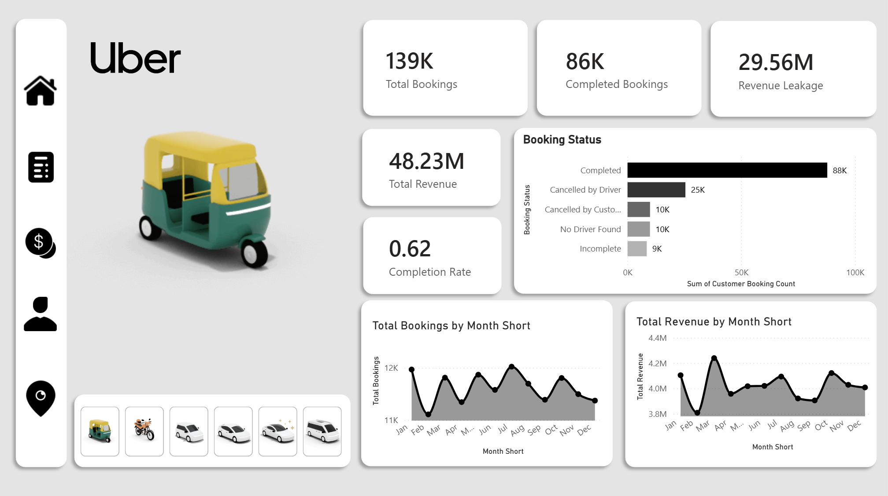
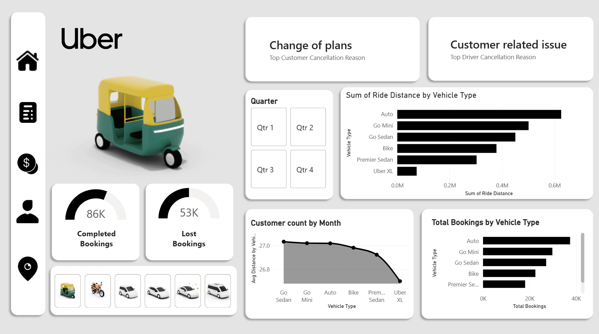
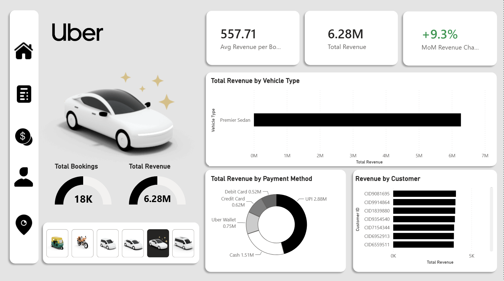
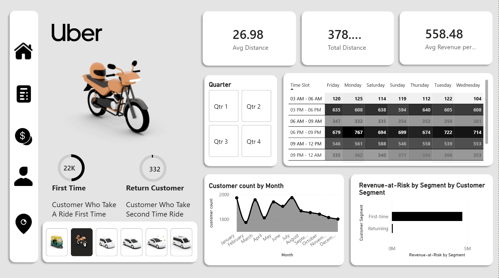

# Uber Bookings & Revenue Dashboard (Power BI)

An end-to-end Power BI dashboard analyzing Uber-style ride-booking data across bookings, revenue, cancellations, vehicle types, and customer behavior — built as a 4-page interactive report (`Uber_dashboard.pbix`).

## Overview

This dashboard turns raw ride-booking data into an executive-style view of the business: how many rides are booked vs. completed, where revenue is leaking, which vehicle types and payment methods drive revenue, and how customer retention looks over time. It's designed to answer the kinds of questions an ops or growth team would actually ask — not just display charts.

## Pages

### 1. Home / Bookings Overview
KPIs for total bookings, completed bookings, revenue leakage, total revenue, and completion rate, plus a breakdown of booking status (completed, cancelled by driver, cancelled by customer, no driver found, incomplete) and monthly trends for bookings and revenue.

### 2. Cancellations & Vehicle Analysis
Top cancellation reasons for customers and drivers, completed vs. lost bookings, ride distance and total bookings broken down by vehicle type (Auto, Go Mini, Go Sedan, Bike, Premier Sedan, Uber XL), and customer count trends by month.

### 3. Revenue Analysis
Revenue KPIs (average revenue per booking, total revenue, month-over-month revenue change), revenue by vehicle type, revenue by payment method (UPI, Cash, Uber Wallet, Credit/Debit Card), and top customers by revenue. Filterable by vehicle type via the sidebar selector.

### 4. Customer & Trip Analysis
Distance and revenue-per-booking KPIs, a day-of-week × time-slot demand heatmap, first-time vs. returning customer counts, monthly customer count trends, and revenue-at-risk by customer segment (first-time vs. returning).

## Key insights surfaced

- Completion rate sits around **62%**, with a meaningful share of bookings lost to driver cancellations, customer cancellations, and "no driver found" — a clear signal for where revenue leakage is coming from.
- **Auto** leads both in total ride distance and total bookings, followed by Go Mini and Go Sedan.
- **UPI** is the dominant payment method by revenue, ahead of Cash, Uber Wallet, and card payments.
- **First-time customers** vastly outnumber returning customers (22K vs. 332 in the sampled view) and also carry the bulk of revenue-at-risk — highlighting a retention gap worth investigating.
- Demand peaks in the **6 PM–9 PM** and **3 PM–6 PM** time slots across all days of the week.

## Tech stack

- **Tool:** Power BI Desktop
- **File:** `Uber_dashboard.pbix` (open with Power BI Desktop to explore interactively — all visuals are filter-linked across pages)

## Repo contents

- `Uber_dashboard.pbix` — full Power BI report file
- `images/` — dashboard page screenshots used in this README

## How to use

1. Download `Uber_dashboard.pbix`
2. Open it in [Power BI Desktop](https://www.microsoft.com/en-us/power-platform/products/power-bi/downloads) (free)
3. Use the vehicle-type icons in the left rail and the Quarter selector to filter the report interactively
